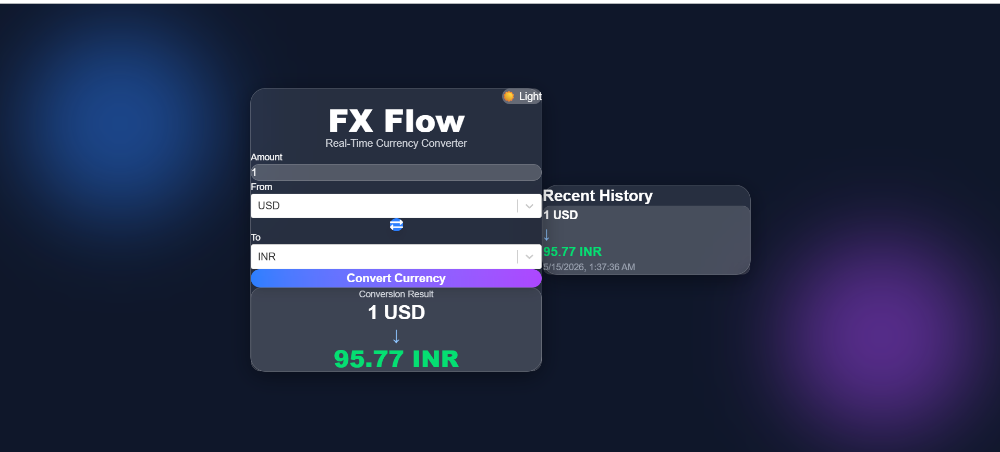
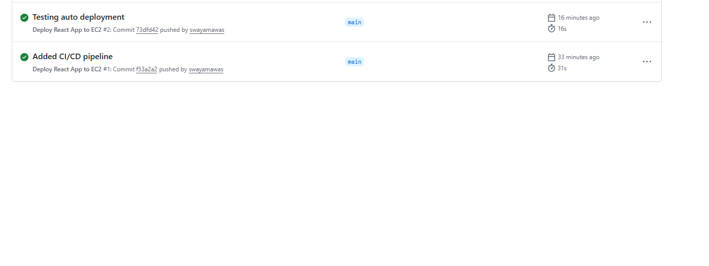
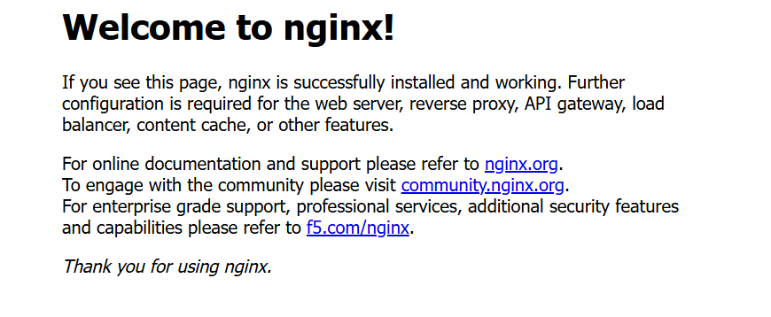

# 🚀 FX Flow — Real-Time Currency Converter

FX Flow is a modern real-time currency converter web application built using React.js and deployed on AWS Cloud infrastructure with a complete CI/CD pipeline.

---

## ✨ Features

- 🌍 Real-time currency conversion
- 💱 Multiple international currencies support
- 📜 Conversion history tracking
- 🌙 Dark / Light mode UI
- ⚡ Fast Vite-powered frontend
- 🎨 Modern responsive UI with Tailwind CSS
- 🔄 Currency swap functionality
- ☁️ Cloud deployment on AWS EC2
- 🚀 Automated CI/CD using GitHub Actions

---

## 🛠️ Tech Stack

### Frontend
- React.js
- Vite
- Tailwind CSS
- Framer Motion
- React Select

### Cloud & DevOps
- AWS EC2
- Nginx
- GitHub Actions
- Linux Server Configuration
- SSH Authentication
- CI/CD Pipeline

---

## ⚙️ CI/CD Workflow

This project uses GitHub Actions for automated deployment.

### Pipeline Flow

```txt
Developer Push
      ↓
GitHub Actions Trigger
      ↓
Install Dependencies
      ↓
Build React App
      ↓
Deploy to AWS EC2
      ↓
Restart Nginx
      ↓
Live Application Updated
🌐 Live Demo
http://54.146.252.117

Note: Public IP may change if the EC2 instance is stopped and restarted.
fx-flow
│
├── client
│   ├── src
│   ├── public
│   └── package.json
│
├── .github
│   └── workflows
│       └── deploy.yml
│
└── README.md
🚀 Local Setup
Clone Repository
git clone https://github.com/swayamawas/fx-flow.git
Navigate to Client
cd fx-flow/client
Install Dependencies
npm install
Start Development Server
npm run dev
☁️ AWS Deployment

The application is hosted on:

AWS EC2 Linux Instance
Nginx Web Server

CI/CD is configured using:

GitHub Actions
SCP Deployment
SSH Key Authentication

## 📸 Screenshots

### 🏠 Homepage



---


---

### 🚀 CI/CD Pipeline



#Nginx setup


👨‍💻 Author
Swayam Awasthi
GitHub: https://github.com/swayamawas
⭐ Acknowledgements

This project was built as part of a Cloud Computing & DevOps deployment workflow demonstration using AWS infrastructure.

📄 License

This project is open source and available under the MIT License.
